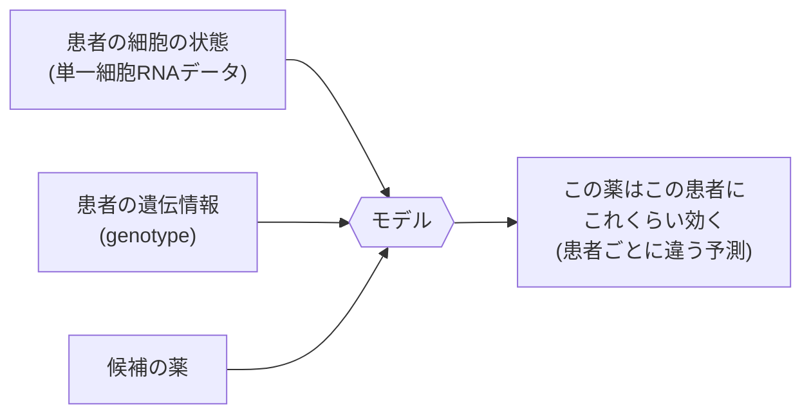
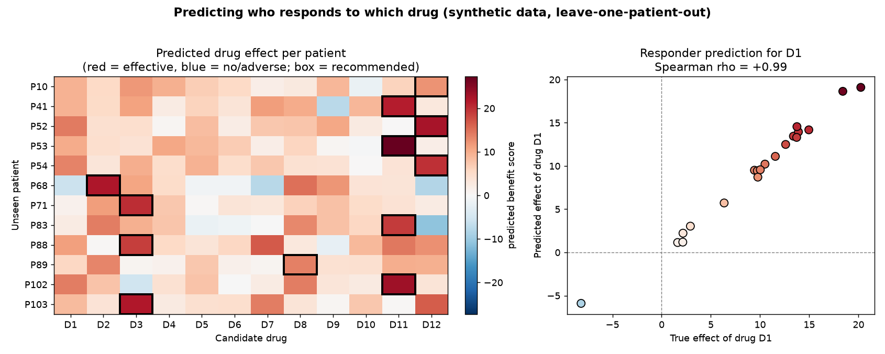
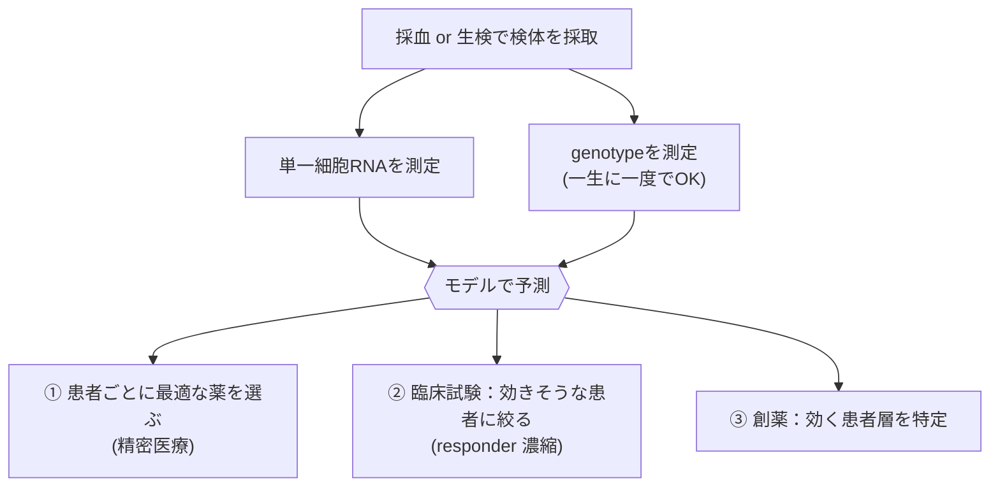

# 00. はじめての方へ — これは何の役に立つのか

専門外の方向けに、このプロジェクトが「何を」「なぜ」やっているのかを、できるだけ
噛み砕いて説明します。数式やモデルの詳細は `docs/01` 以降に譲ります。

## 1. 一言でいうと

> **「同じ薬でも、人によって効き方が違う」** ——
> この“個人差”を、患者の細胞データと遺伝情報からコンピュータで **予測** しようとする試みです。

医者が薬を選ぶとき、いまは「平均的にはこの薬が効く」という情報で決めがちです。でも実際は、
ある人にはよく効き、別の人には効かない、あるいは副作用が強く出る、ということが起きます。
もし「この患者には、この薬がこれくらい効く」を事前に当てられれば、
**試行錯誤を減らし、患者ごとに最適な薬を選べる**ようになります。

## 2. 「同じ薬でも効き方が違う」現実の例

これらは **実際に医療で知られている例** です（このリポジトリのデモは合成データですが、
こうした現象を予測することが目的です）。

| 例 | 何が起きるか | なぜ個人差が出るか |
|---|---|---|
| **ワルファリン**（血液をサラサラにする薬） | 同じ量でも、効きすぎて出血する人と、効かず血栓ができる人がいる | `CYP2C9` `VKORC1` という遺伝子の型で必要量が大きく変わる（FDA も用量目安を記載） |
| **クロピドグレル**（血栓予防の抗血小板薬） | 効く人と効きにくい人がいる | 肝臓の `CYP2C19` が弱い体質だと薬を活性化できず効果が出にくい |
| **チオプリン**（白血病・自己免疫の薬） | ある体質の人に通常量を使うと重い副作用（骨髄抑制） | `TPMT` / `NUDT15` の変異で薬を分解できない（日本人では `NUDT15` が重要） |
| **COVID-19 のデキサメタゾン**（ステロイド） | 重症（酸素が必要）では死亡を減らすが、軽症ではむしろ益がない | **病状によって同じ薬の効果が逆向き**（RECOVERY 試験） |
| **がんの分子標的薬** | `EGFR` 変異のある肺がんに EGFR 阻害薬、`HER2` 陽性乳がんにハーセプチンが効く | 腫瘍の遺伝子変化（バイオマーカー）で効く人が決まる。免疫療法も奏効する人としない人がいる |
| **糖尿病のメトホルミン** | 効きに個人差 | 取り込みトランスポーター（`SLC22A1` など）の遺伝的違いが関係すると研究されている |

ポイント: 個人差の原因は **(a) 生まれ持った遺伝子の型（体質）**、**(b) がんなら腫瘍の変異**、
**(c) 病状（重症度など）** といろいろですが、どれも「患者の状態を見れば予測できるはず」という
共通点があります。本プロジェクトはこの“予測”を機械学習で行います。

## 3. このモデルは何をするのか（イメージ）



- **単一細胞 RNA データ**: 患者の細胞 1 個 1 個で「どの遺伝子がどれだけ働いているか」を測ったもの。
  患者の“今の状態”を細かく表します（scGPT などの基盤モデルが扱う対象）。
- **genotype**: 生まれ持った遺伝子の型。薬の代謝・効きやすさを左右します（上の表の `CYP2C9` 等）。
- モデルは「薬の平均的な効果」に **その患者ぶんの補正** を掛けて、個別化した予測を出します。
  詳しくは `docs/01`（“摂動 × 個人の相互作用”という仕組み）。

## 4. 現実に、患者の細胞と遺伝情報は取れるのか？

「人の遺伝子を取るのは難しいのでは？」と思うかもしれませんが、実は
**遺伝情報の取得はむしろ簡単**で、難しいのは「どの組織の細胞を取るか」です。
マウスのように解剖する必要はありません。

### 遺伝情報（genotype）── 容易、しかも一度きり
- **採血・唾液・頬の内側の綿棒**から DNA が取れる（痛みもほぼなし）。
- 生まれ持った遺伝子型は **全身どの細胞でも同じ・一生変わらない**ので、**一生に一度**測れば十分。
- すでに臨床で実用化（ワルファリン/クロピドグレル/チオプリン/アバカビルなどの**投薬前検査**）。
  コストも数千〜1万円程度まで低下。→ **遺伝情報はむしろ取りやすい方**。

### 単一細胞 RNA ── 組織で難易度が違う
- **血液の免疫細胞（PBMC）**: **採血だけ**。OneK1K が約1000人で実際にやったのもこれ。
  COVID・白血病・自己免疫（ループス等）など **免疫が関わる病気に強い**。
- **固形のがん・臓器**: **生検（biopsy）**が必要でやや侵襲的。ただし、がんでは診断のため生検は
  元々ルーチンで、腫瘍の単一細胞解析も研究・臨床試験で実施されている。
- **脳の神経など採取困難な組織**: 生きた人からは難しく、ここは**限界**（血液を代理指標にする等の工夫）。

### 「人では実験できない」をどう乗り越えるか
マウスは「薬を投与して効果を見る」を自由にできるが、生身の人ではできない。
**だからこそ予測モデルに価値**がある:
- 一度取れる検体（採血＋遺伝子）から、**実際に投与せずに**「効くか」を当て、無駄な投薬を避ける。
- さらに **ex vivo（体外）実験**: 患者から取り出した細胞を**シャーレの中で**薬にさらして反応を測る
  （白血病の薬剤感受性試験、患者由来オルガノイド、PDX）。**患者本人を実験台にせず**試せる。

| 入力 | 取得方法 | 難易度 |
|---|---|---|
| genotype（遺伝情報） | 採血・唾液（一生に一度） | 容易・実用済み |
| 単一細胞 RNA（血液 PBMC） | 採血 | 容易 |
| 単一細胞 RNA（固形腫瘍） | 生検 | 中（がんでは元々実施） |
| 単一細胞 RNA（脳など） | 採取困難 | 高（限界・代理指標で工夫） |

## 5. 実際に動かすと何が出るか（デモ）

`python scripts/demo_precision_medicine.py` を実行すると、合成データ上で
「**学習に使っていない未知の患者**」に対して薬の効きを予測し、こんな出力が出ます（抜粋）:

```
【1】患者ごとの『最も効く薬』の推薦（未知患者・モデル予測）
  集団平均だけで決めると、全員に同じ薬『D11』を薦めることになる。
  → モデルは患者の genotype を見て、患者ごとに違う薬を薦められる:
    患者      推薦薬(予測)   予測効果   本当の最適薬   当たり?
    患者52   D12          22.58     D12          ○
    患者68   D2           22.16     D2           ○
    患者71   D3           20.04     D3           ○
  推薦が本当の最適薬と一致: 18/20 人

【2】薬『D1』に対する responder（効く人）の見分け
    効くと予測 TOP3 : 患者110(+19.10), 患者106(+18.64), 患者107(+14.55)
    効かない予測 LOW3: 患者158(+1.19), 患者71(+1.15), 患者68(-5.90)
  予測スコア vs 真の効きの順位相関 (Spearman) = +0.99
```

この結果を図にすると（`python scripts/make_figures.py` で再生成可能）:



- **左の図**: 行＝未知の患者、列＝候補薬。色は予測した効きの強さ（**赤＝効く、青＝効かない/逆効果**）、
  **黒い枠＝その患者への推薦薬**。枠の位置が患者ごとにバラバラ＝「人によって最適な薬が違う」が一目で分かる。
- **右の図**: ある薬 `D1` の **予測（縦）vs 真の効き（横）**。点がほぼ対角線に並び（Spearman +0.99）、
  左下の患者は予測も真値もマイナス＝「効かない/逆効果」を正しく当てている。

読み方:
- **【1】** 全員に同じ薬（集団平均の最適薬 `D11`）を出すのではなく、患者ごとに別の薬を推薦でき、
  20 人中 18 人で“本当の最適薬”と一致しました。
- **【2】** ある薬 `D1` について、効く人（responder）と効かない人を予測で見分けられ、
  真の効きとの順位相関は +0.99（ほぼ完璧）。`患者68` は予測がマイナス＝「効かない/逆効果」。

> これは **合成（架空）データ** での実演です。実在薬の効果を主張するものではありませんが、
> 「個人差を予測する」という中心アイデアが機能することを具体的に示しています。

## 6. 何の役に立つのか（3 つの用途）

実際の流れ（検体採取から薬の選択まで）をイメージにすると:



1. **患者に合った薬選び（精密医療）**: 「平均的に良い薬」ではなく「この患者に効く薬」を提案。
   ワルファリンの用量を遺伝子型で調整する、のような発想を、より多くの薬・患者へ。
2. **臨床試験の効率化**: 「効くと予測された患者」に絞って試験すれば、少ない人数で効果を示せ、
   効かない人への無駄な投薬を減らせます（responder 濃縮）。
3. **創薬**: 新薬がどんな患者層に効きそうかを早期に絞り込み、開発の当たりをつけられます。

## 7. 正直な注意（過大評価しないために）

- 本リポジトリのデモ・テストは **すべて合成データ**で、実際の臨床効果を予測したものではありません。
  実データ（OneK1K 等）への接続手順は `docs/07` / `docs/10` にありますが、遺伝情報は機微情報で、
  利用には倫理審査・データアクセス許可が必要です。
- 個人差を当てるには **十分な人数（ドナー数）のデータ**が要ります（`docs/04 §4.5`）。
- 「本当に薬の効果か、それとも実験のクセ（batch）か」を見分ける注意も必要です（`docs/09`）。

## 8. もっと知るには

- 全体像と仕組み: `docs/01_design.md`
- 遺伝情報の使い方: `docs/02_individual_conditioning.md`
- 「個人差を当てられたか」の測り方: `docs/04_evaluation.md`
- まず動かす: `README.md` のクイックスタート、`scripts/demo_precision_medicine.py`
